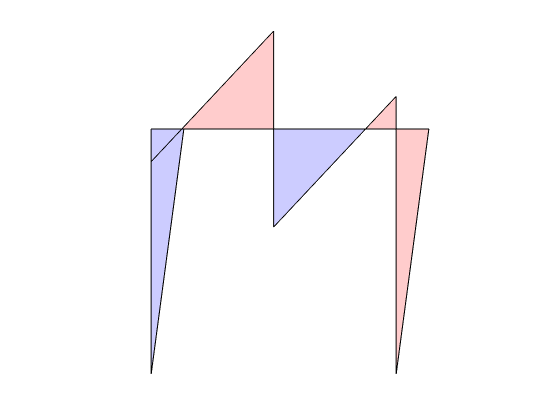

# HW-3 Problem 3


The purpose of the structural model in Fig. $3(a)$ is the study of the risk of a mid-rise building forming a soft first-story collapse mechanism under the combined action of a total gravity load $P_{v}$ and a lateral load. The latter is assumed to be linearly distributed over the height of the building with a resultant $P_{h}$ located at a distance $H$ above the first floor. The building has a single bay of length $L$ and the height of the first story is 12 feet. The ratio of $(H-h)/ L$ is $4 .$ The first story columns consist of $\mathrm{W} 14 \mathrm{x} 426$ steel sections with Grade 50 Steel and are pinned at the foundation. The first story columns can be assumed restrained against rotation at the top, since they frame into a girder that can be assumed to be infinitely rigid in flexure. The girder and columns can be assumed to be inextensible.

## 3.1 - AISC H2

Verify the maximum lateral force $P_{h}$ that the first story can resist for an ultimate load factor $\lambda=2.0$ under the assumption that the gravity load $P_{v}$ is negligible relative to the lateral load $P_{h}$ using the diamond shaped plastic limit surface in Fig. 4.6 of the course reader (AISC Equation H2-1).


```matlab
CleanStart
LimEqn = 'AISC-H2';
beta  = 0;
Ph = 217.67;
[lamc,Qc] = hw3p3(beta,LimEqn,Ph,true);
lamc
```

    
    Optimal solution found.
    
    
    lamc =
    
        2.0000
    
    
    





## 3.2 - AISC H1

How much can the maximum lateral force $P_{h}$ be increased by using the $N$ -M plastic limit surface of the AISC specification in equation 4.7 of the course reader?


```matlab
CleanStart
LimEqn = 'AISC-H1';
beta  = 0;
Ph = 236.64;
[lamc,Qc] = hw3p3(beta,LimEqn,Ph);
lamc
```

    
    Optimal solution found.
    
    
    lamc =
    
        2.0000
    
    
    

## 3.3 - Vertical Load

Repeat the preceding questions for the case that the gravity load $P_{v}$ is equal to $50 \%$ of the lateral load $P_{h}$ under the assumption that it remains constant during the application of the lateral load and is, therefore, assigned an ultimate load factor of 1.2.

### 3.3.1


```matlab
CleanStart
LimEqn = 'AISC-H2';
beta  = 1/2;
Ph = 217.67;
[lamc,Qc] = hw3p3(beta,LimEqn,Ph);
lamc
```

    
    Optimal solution found.
    
    
    lamc =
    
        2.0000
    
    
    
