Inelasticity in Frame Sections
==============================

In this section, the response of a nonlinear cross section is analyzed,
which is assumed to represent a thin slice of a frame member, for which
fiber strains can be considered constant.

Part A: T-Section
-----------------

``` {.matlab}
Output = Hw12P1A(nft, nwl, SIntTyp, Hk, yc, N_Np, Tmax, LoadOpt)
```

### Solution stability under perfect plasticity

{#fig:mc1}

fig. 1 presents the moment-curvature response for the first two cases,
which utilize perfectly-pastic and effectively plastic ($H_k = 10^{-9}$)
materials, respectively. Additionally, this figure tracks the movement
of the neutral axis location throughout the moment curvature analysis
for runs `\ref{run:P1-0}`{=tex} and `\ref{run:P1-1}`{=tex}. At each load
step, this location is calculated according to the following relation:

$$y_{NA} = \dfrac{\epsilon_{ref, i}}{\kappa_i} - y_{ref}$$

Where $\epsilon_{ref, i}$ is the axial strain measured at the current
reference axis location, $y_{ref}$.

### Effects of axial force


### Cyclic loading

### 4

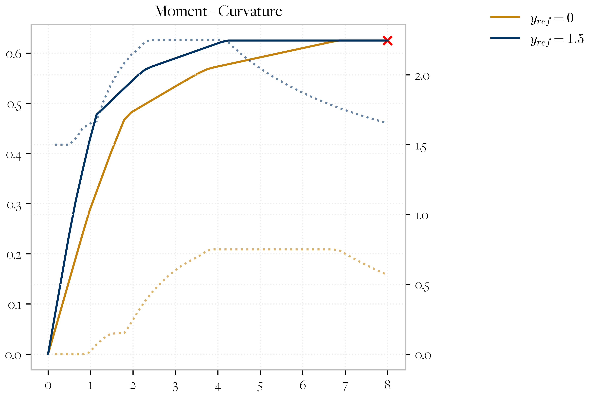{#fig:mc4}

### 5

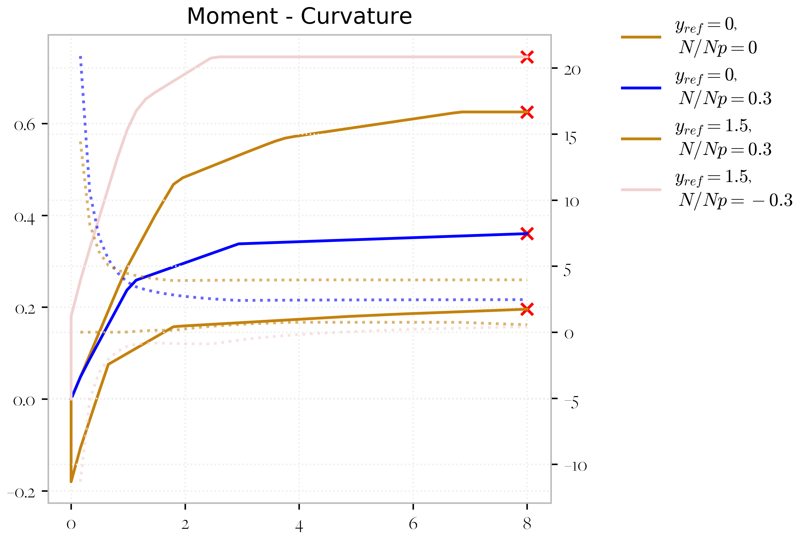{#fig:mc5}

### 6

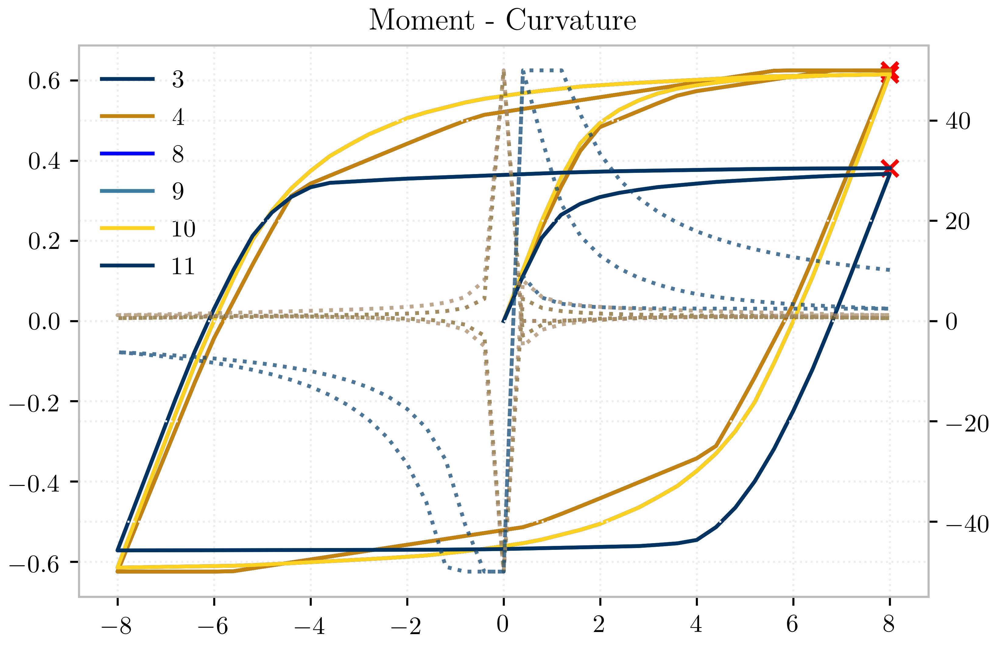


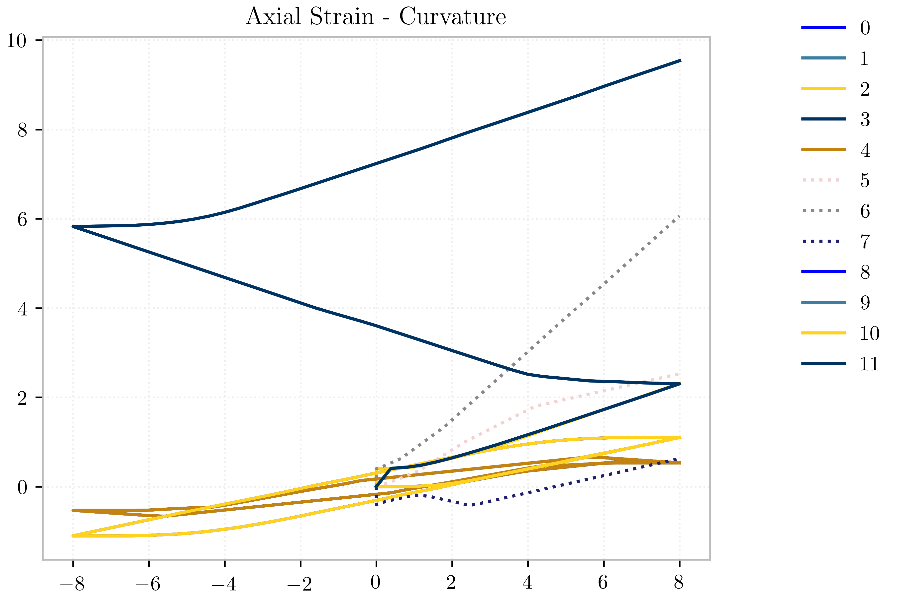

Part B: Rectangular Section
---------------------------

This problem was used to study some possible applications of automatic
differentiation to inelastic section analysis. Using a differentiable
programming framework, a return-mapping algorithm was implemented which
accounts for linear or nonlinear isotropic hardening, and basic
kinematic hardening. This algorithm is called to evaluate cross
sectional forces for a given strain distribution, and this procedure is
differentiated with forward-mode automatic differentiation to yield the
tangent stiffness of the cross section.

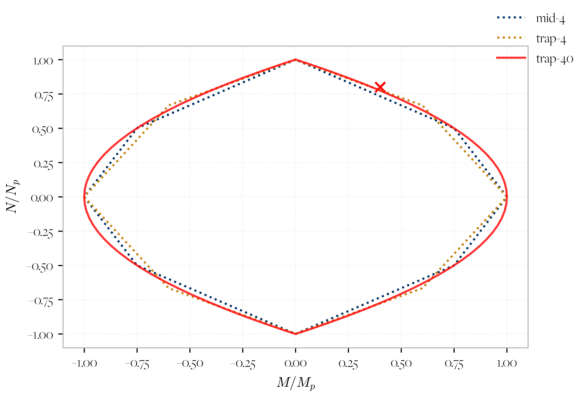

plastic surface

### Experiment I: O-A-B-O

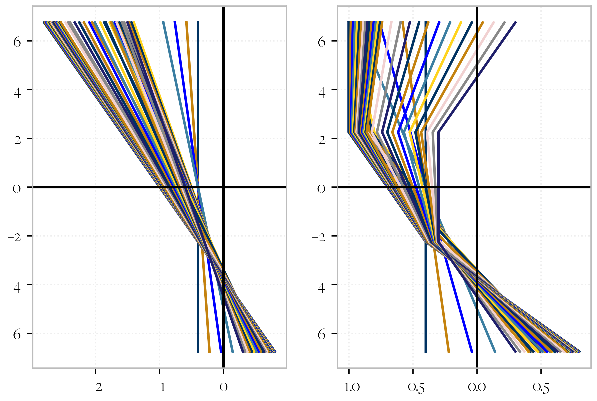

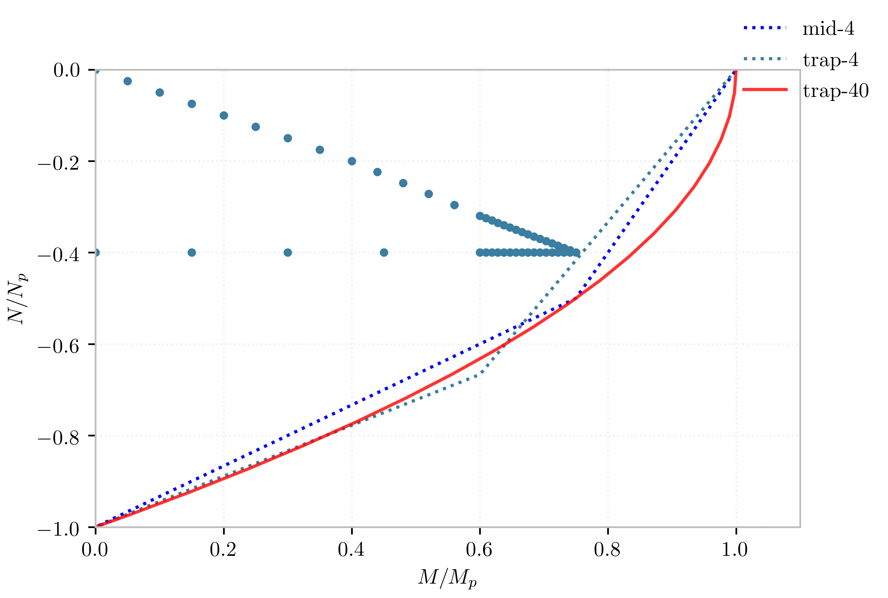{width="60%," height="60%"}

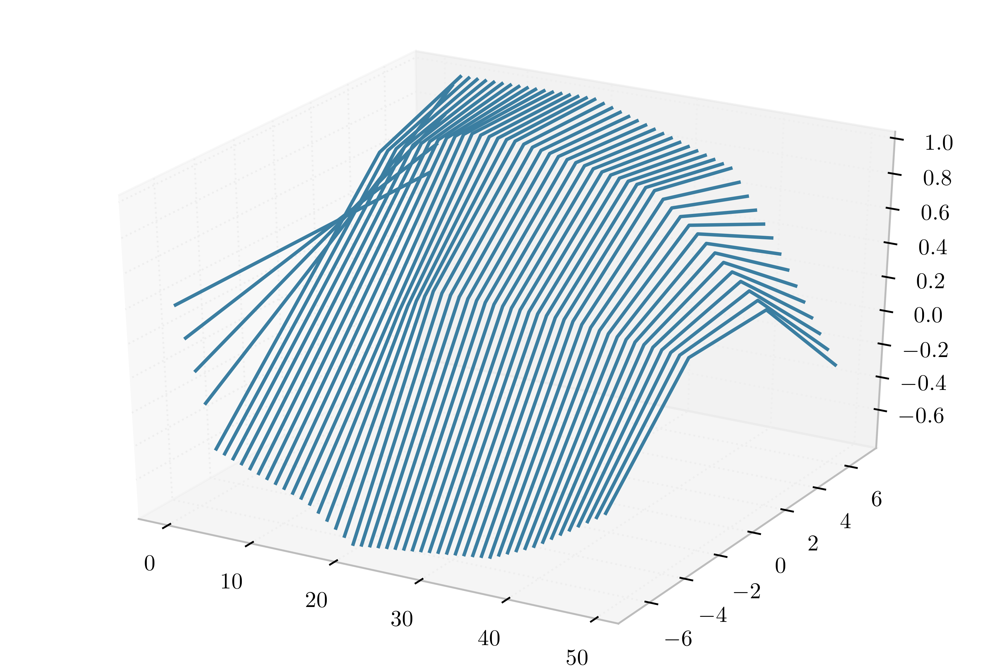{width="60%," height="60%"}

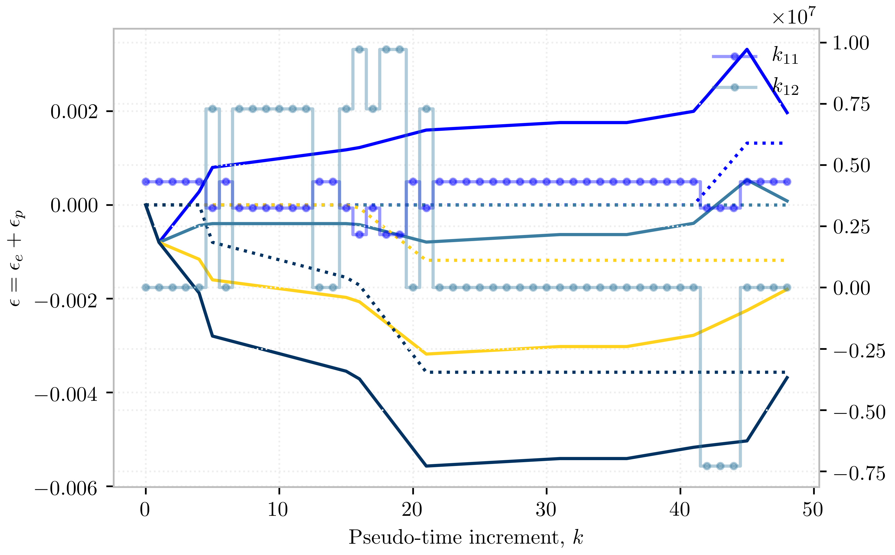{#fig:ssh-oabo}

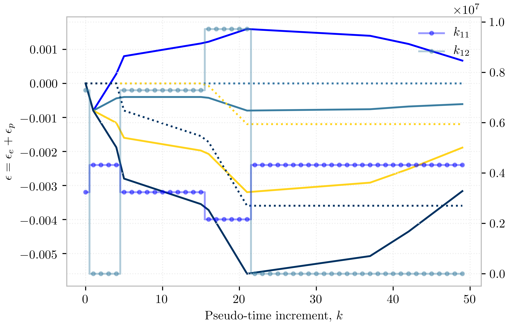

### Experiment II: O-A-B-C-O

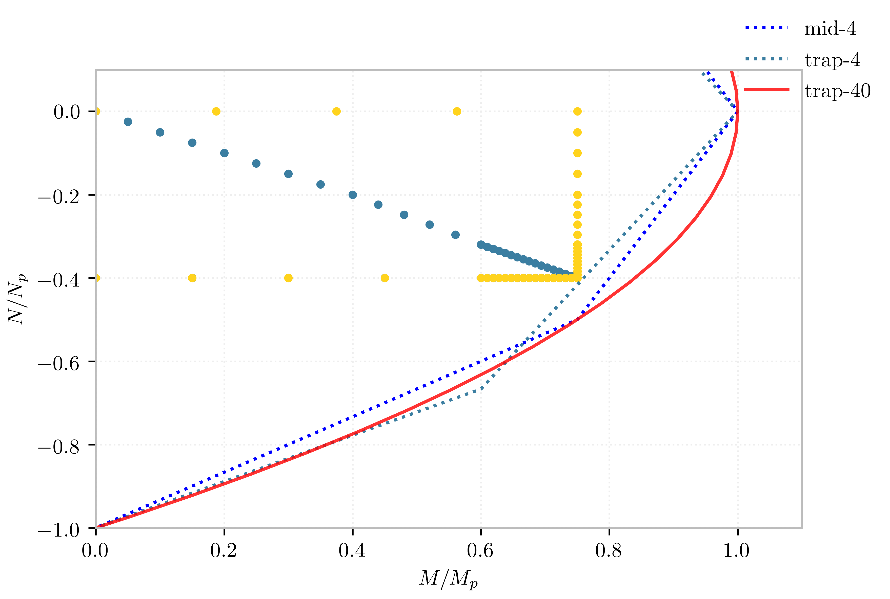{width="60%,"
height="60%"}

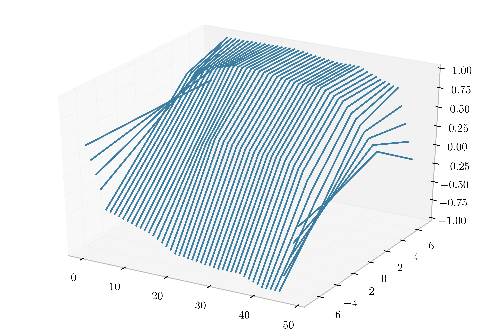{width=60%,height="60%"}


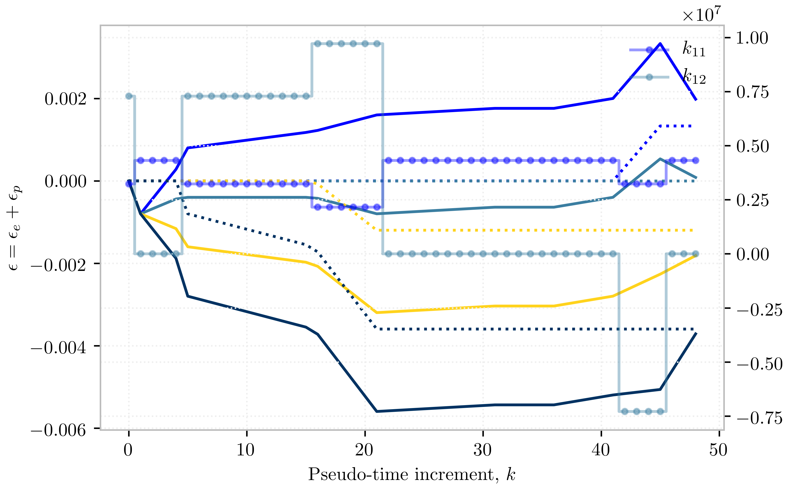{#fig:ssh-oabco}


Inelasticity in Frame Members
=============================

``` {.matlab}
Output = Hw12P2A( Elem,     Hkr ,          )
Output = Hw12P2B( EIntType, Hkr, SIntTyp,nfl,nwl,nIP)
```

Concentrated plasticity
-----------------------

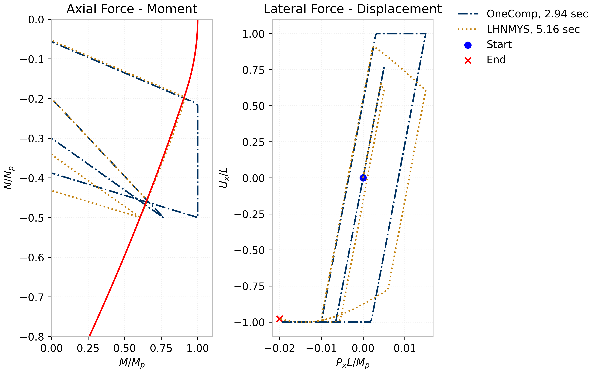{#fig:cpcol}

The cyclic response of two concentrated plasticity elements is compared
in fig. 1. Under the conditions of this analysis, the `LHNMYS` element
appears to very closely approximate the true plastic limit capacity of
the cross section, shown in red in fig. 1 (a). However, it should be
noted that the "exact" surface which is depicted here is only
representative of a single cross section slice, and not neccessarily the
full column. The lack of any axial-moment interaction in the `OneComp`
element is very evident in from plots.

The additional computational time required by the `LHNMYS` element
appears to be considerable, but it remains to be seen how this time
demand will scale to larger models.

Distributed inelasticity
------------------------


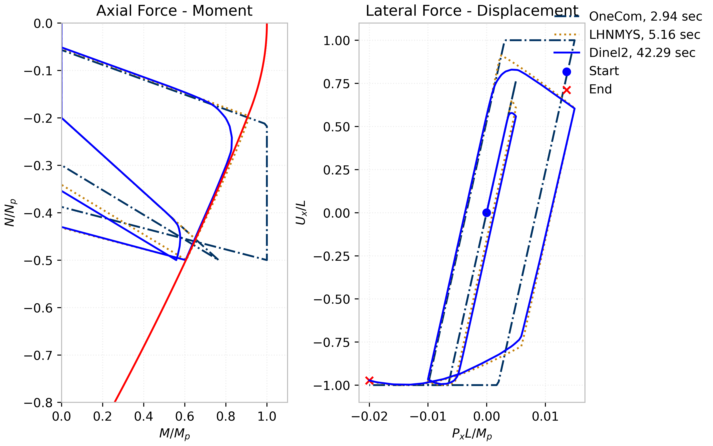

Nonlinear Static Analysis
=========================

A nonlinear static analysis of an 8-story framed structure is performed
useing a function with the following handle:

``` {.matlab}
Output = Hw12P3(Geom, Column, Dlam0, nostep, Hkr)
```

In this function, `Geom` specifies the frame element geometric stiffness
(`linear`, `PDelta` or `corotational`). The argument `Column` is used to
specify the finite element formulation used in the vertical elements of
the model. For the purpose of this study, and that of
sec. **¿sec:4-nta?** `\ref{sec:4-nta}`{=tex} ,all girders are modeled
using the `Inel2dFrm_wOneComp` formulation.

Inelastic without interaction
-----------------------------

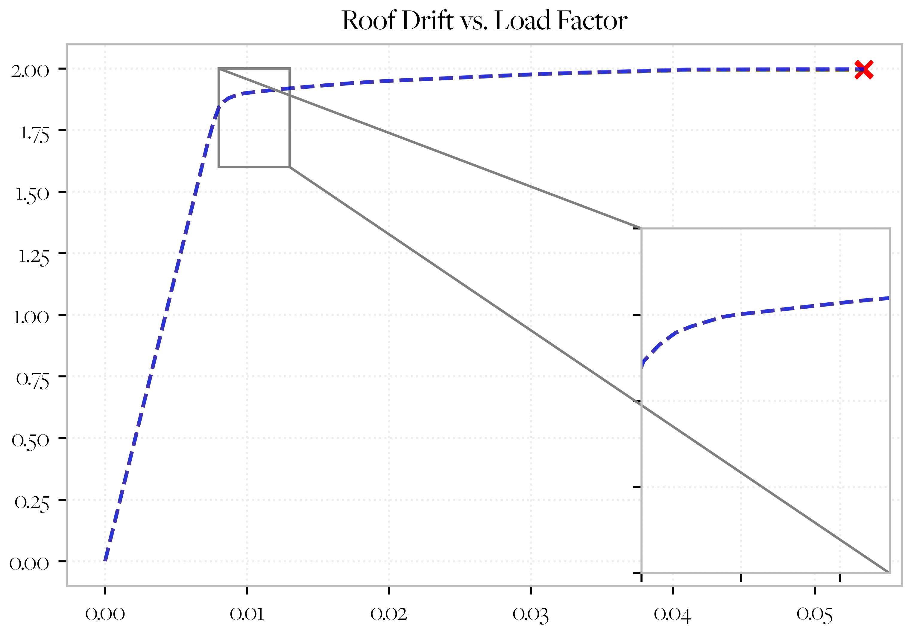{#fig:lr1}

The pushover curves for two cases are presented in fig. 1, which
consider two different concentrated plasticity elements. The zoomed
field indicates that the curves are essentially identical.

2
-


The pushover curves for all prescribed transient analysis cases are
presented above. The legend indicates the element name, along with the
length of time required by the analysis to conclude.

Nonlinear Transient Analysis
============================

``` {.matlab}
[output,Model] = Hw12P4(Geom, Column, Factor)
```

Inelastic without interaction
-----------------------------


2
-


3
-


4
-

Other
-----


