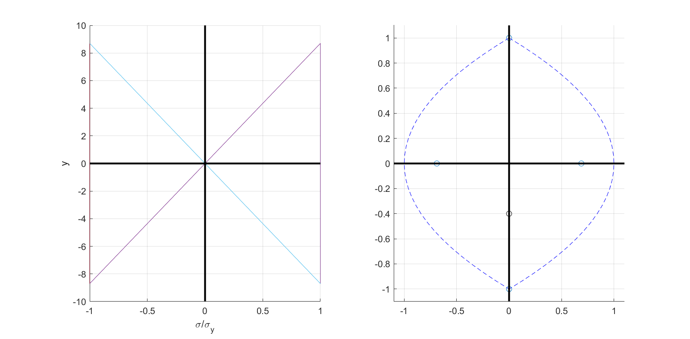
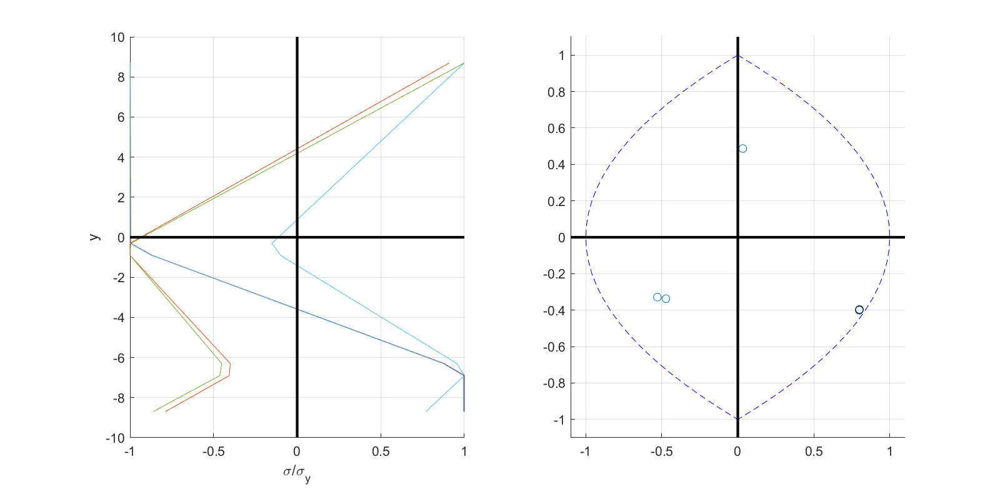
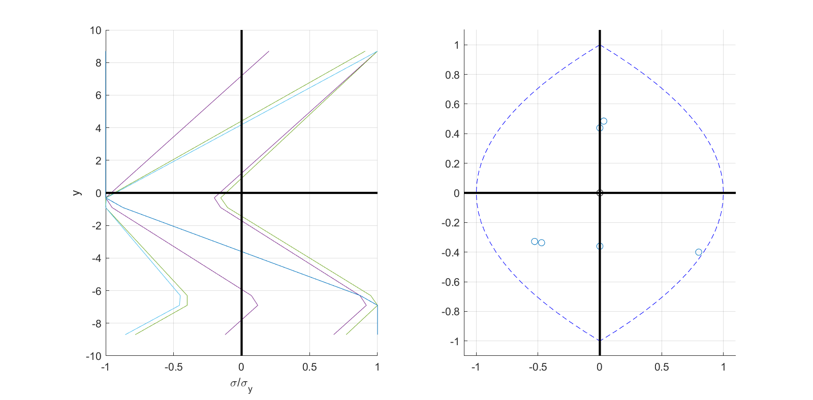
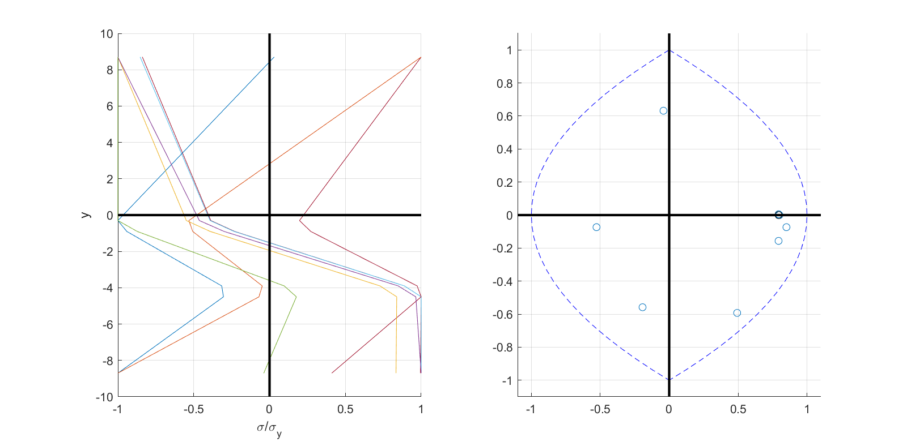

---
# title: Yield surface evolution
# author:
#   - Claudio Perez
header-includes: <script src="https://gist.github.com/claudioperez/c6e9c9f108fe3706ef18aecd6984444a.js?file=surf_ex_2.m"></script> 
...

# Yield Surface Evolution

This note explores how the yield surface of certain cross sections evolve as they undergo combined flexural and axial loading into the inelastic range. The scope of the discussion is limited by the following assumptions:

1. Shear interaction is negligible.
2. Planar sections remain plane under deformation.
3. For doubly symmetric sections, flexure occurs about a principle axis.
4. For singly symmetric sections, flexure occurs about the asymmetric principle axis.

An implementation is developed and examples are presented for a perfectly plastic rectangular homogeneous section, but the generalization of this case is relatively straight forward.

## Formulation

We seek to define a surface, $F_\tau$, at instant $\tau$ by the following set of moment-axial force ordered pairs:

$$
\{ \left( M, P \right) \in \mathbb{R} \times \mathbb{R} \mid \Phi(M,P) \}
$$

where $\Phi$ is satisfied when $M$ and $P$ are resultants of a stress distribution, $\sigma$, meeting the condition $(\exists \mathbf{x} \in \Omega ) [\sigma ( \mathbf{x} ) = \sigma_{y, \tau }(\mathbf{x})]$ for material behavior with only one component. In this condition, $\mathbf{x} \in \Omega$ denotes a point in the cross section, and $\sigma_{y,\tau}$ is the limit stress at time $\tau$.

For the case of perfect plasticity without hardening, the dependence of $\sigma_y$ on $\mathbf{x}$ and $\tau$ is dropped. Additionally, for a singly symmetric homogenous section obeying the assumptions stated above, the stress and strain fields are constant along the flexural axis. After discretizing such a cross section into $n_{IP}$ integration points, the aforementioned condition is restated approximately as follows:

$$
\Phi(M,P) \implies \exists i \in N \mid \sigma(x_i) = \sigma_y 
$$

where N is the set of integration point indices $\{i \in\mathbb{Z}^+ \mid i \le n_{IP} \}$ and $x_i$ is a scalar distance orthogonal to the flexural axis.

The discrete problem may then be stated as follows:

> Given a vector, $\hat{\mathbf{x}}$, of $n_{IP}$ integration point locations, and a vector of corresponding stresses, $\mathbf{y}_\tau$ at instant $\tau$, find the following set, $Y$, of admissible stress vectors, $\mathbf{y}$:
>$$Y_\tau = \{
>  \mathbf{y} \in \mathbb{R}^{n_{IP}} \mid
>      (\exists a \in \mathbb{R})(\exists m \in \mathbb{R})[\mathbf{y} - \mathbf{y}_\tau = a + m\hat{\mathbf{x}}] \text{ and }
      (\exists i \in N)[ y_i = \sigma_y ]
\} $$
>which is the set of all discrete stress vectors, $\mathbf{y}$, such that there exists an admissible strain increment $\Delta \varepsilon = \Delta\varepsilon_a + \Delta\kappa \mathbf{x}$ which will produce the elastic stress increment $\mathbf{y} - \mathbf{y}_\tau = E \Delta\varepsilon$, and there exists an element, $y_i$, in $\mathbf{y}$ that is equal to the limit stress.

Unlike similar discrete approximations of the **plastic** limit surface, the accuracy of this approximation for the **elastic** limit surface is dependent on the loading history. Furthermore, this dependence is very difficult to predict. As it is related to the distance between integration points and extrema in the residual stress field. 

## Implementation

The implementation of this problem is divided into two functions, `plot_evol` and `lim_clip`. The former is a wrapper to the latter. `plot_evol` extracts the section state and other parameters from the standard `FEDEASLab` data structures and normalizes the residual stress oridinates before calling `lim_clip`.

The function `lim_clip` is formulated in terms of an arbitrary set of abscisssas and ordinates, which are supplied to the argument `XY` as an array of size $(n_{IP},2)$. Each ordinate, `XY(i,2)`, corresponds to the stress $y_i \in \mathbf{y}_\tau$ at integration point, `i`. The values supplied in `XY` should be normalized such that the codomain, `XY(:,2)`,  is the interval $[+1, -1]$. The function iterates over every integration point in the set $N$, carrying out 4 separate nested iterations over the remaining integration points indices, $\{ j \in\mathbb{Z}^+ \mid j \le n_{IP}, j \ne i\}$.  This is a very computationally expensive procedure that grows quickly with $n_{IP}$. The return variable, `Y_lim`, is a subset of the piecewise continuous set $Y_\tau$ with column vectors `Y_lim(:,k)` defining points of discontinuity.

## Examples

The function `plot_evol` is used in these examples to produce a figure with two plots. The plot on the left shows the normalized stress vectors $y_k$ (also `Y_lim(:,k)`) that correspond to points in the normalized resultant plot on the right. It should be noted, however, that the stress distribution corresponding to the *current* stress distribution is not shown.

Examples are executed through the following script:

<script src="https://gist.github.com/claudioperez/c6e9c9f108fe3706ef18aecd6984444a.js?file=surf_ex_2.m"></script>

```{include=surf_ex_2.m .matlab}
```


### Example 1 - Path O-A-B-O' (`LoadOpt=3`)







### Example 2 - Path O-A-B-C-O' (`LoadOpt=4`)

This example is identical to the previous up to point B, after which unloading occurs under a constant moment up to point C.




